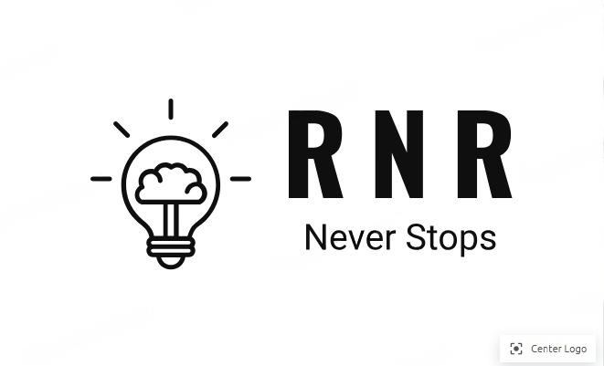

# Rolan Lobo - Personal Portfolio Website

<div align="center">
  
</div>

## 📋 Overview

A modern, responsive personal portfolio website showcasing my skills, projects, and professional experience. This portfolio features smooth animations, interactive elements, and a clean design to effectively present my work and capabilities to potential clients and employers.

## ✨ Features

- **Responsive Design**: Fully responsive layout that works on all devices from mobile to desktop
- **Modern UI/UX**: Clean, professional design with smooth transitions and animations
- **Interactive Elements**: Project filtering, testimonial carousel, and contact form
- **Performance Optimized**: Lazy loading images and optimized assets for fast loading
- **Cross-Browser Compatible**: Works seamlessly across all modern browsers
- **Sections Include**:
  - Hero/Introduction
  - About Me
  - Skills & Technologies
  - Project Portfolio with filtering
  - Client Testimonials
  - Contact Form
  - Social Media Integration

## 🛠️ Technologies Used

- **Frontend**:
  - HTML5 Semantic Markup
  - CSS3 with Custom Properties and Grid/Flexbox
  - Modern JavaScript (ES6+)
- **Optimization**:
  - Critical CSS loading strategy
  - IntersectionObserver API for scroll effects
  - Image lazy loading implementation
- **Libraries**:
  - AOS (Animate On Scroll)
  - Font Awesome icons
  - Google Fonts (Poppins)

## 🚀 Projects Featured

1. **InvisioVault** - A Flask web application for file steganography
2. **CursorCam** - Hands-free mouse control using facial recognition
3. **Sortify** - File organization tool that automatically categorizes files
4. **DocuContact** - Cross-platform contact management application
5. **YT-Downloader** - YouTube video and audio downloader web application

## 📁 Project Structure

```
├── css/
│   ├── critical.css        # Critical above-the-fold styles
│   ├── style.css           # Core styling
│   ├── cardsstyle.css      # Project card components
│   ├── new-testimonials.css # Enhanced carousel styles
│   └── smooth-transitions.css # Animation effects
├── js/
│   ├── main.js             # Core functionality
│   ├── lazy-loading.js     # Image optimization
│   ├── new-testimonials.js # Interactive testimonial carousel
│   └── image-optimizer.js  # Responsive image handling
├── img/                   # Optimized web images (WebP format)
├── index.html             # Main entry point
└── README.md              # Project documentation
```

## 🔧 Setup and Usage

1. Clone the repository:
   ```bash
   git clone https://github.com/Mrtracker-new/RNR.git
   ```

2. Navigate to the project directory:
   ```bash
   cd RNR
   ```

3. Open `index.html` in your browser to view the website locally.

4. To deploy, upload all files to your web hosting service.

## 🎨 Customization

To customize this portfolio for your own use:

1. Replace personal information in `index.html`
2. Update project details and images in the projects section
3. Modify the color scheme by changing CSS variables in `style.css`
4. Replace images in the `img` folder with your own

## 📱 Contact

- **Name**: Rolan Raphael Lobo
- **Email**: rolanlobo901@gmail.com
- **GitHub**: [https://github.com/Mrtracker-new](https://github.com/Mrtracker-new)
- **LinkedIn**: [https://www.linkedin.com/in/rolan-lobo-93368a239/](https://www.linkedin.com/in/rolan-lobo-93368a239/)

## 📄 License

This project is open source and available under the [MIT License](LICENSE).

---

⭐️ From [Rolan Lobo](https://github.com/Mrtracker-new)
